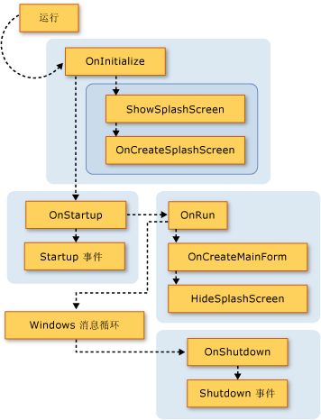

# 扩展 Visual Basic 应用程序模型
[!INCLUDE[vs2017banner](../../../csharp/includes/vs2017banner.md)]

您可以通过重写 <xref:Microsoft.VisualBasic.ApplicationServices.WindowsFormsApplicationBase> 类的 `Overridable` 成员来向应用程序模型添加功能。  可以使用此方法自定义应用程序模型的行为，并添加在应用程序启动和关闭时需调用的自己的方法。  
  
## 应用程序模型的图形概述  
 本节以图形的方式呈现 Visual Basic 应用程序模型中的函数调用序列。  下一节将详细描述每个函数的用途。  
  
 以下图形显示了在普通的 Visual Basic Windows 窗体应用程序中的应用程序模型调用序列。  当 `Sub Main` 过程调用 <xref:Microsoft.VisualBasic.ApplicationServices.WindowsFormsApplicationBase.Run%2A> 方法时序列开始。  
  
   
  
 Visual Basic 应用程序模型还提供了 <xref:Microsoft.VisualBasic.ApplicationServices.WindowsFormsApplicationBase.StartupNextInstance> 和 <xref:Microsoft.VisualBasic.ApplicationServices.WindowsFormsApplicationBase.UnhandledException> 事件。  以下图形显示了有关引发这些事件的机制。  
  
   
  
   
  
## 重写基方法  
 <xref:Microsoft.VisualBasic.ApplicationServices.WindowsFormsApplicationBase.Run%2A> 方法定义 `Application` 方法的运行顺序。  默认情况下，Windows 窗体应用程序的 `Sub Main` 过程调用 <xref:Microsoft.VisualBasic.ApplicationServices.WindowsFormsApplicationBase.Run%2A> 方法。  
  
 如果应用程序是普通应用程序（多实例应用程序），或者是单实例应用程序的第一个实例，则 <xref:Microsoft.VisualBasic.ApplicationServices.WindowsFormsApplicationBase.Run%2A> 方法按照以下顺序来执行 `Overridable` 方法：  
  
1.  <xref:Microsoft.VisualBasic.ApplicationServices.WindowsFormsApplicationBase.OnInitialize%2A>.  默认情况下，此方法会设置主应用程序线程的可视样式、文本显示样式以及当前主体（如果应用程序使用 Windows 身份验证），如果没有使用 `/nosplash` 或 `-nosplash` 作为命令行参数，则还会调用 `ShowSplashScreen`。  
  
     如果此函数返回 `False`，则取消此应用程序的启动序列。  如果存在不应该运行应用程序的情况，则这种取消行为很有用。  
  
     <xref:Microsoft.VisualBasic.ApplicationServices.WindowsFormsApplicationBase.OnInitialize%2A> 方法调用下列方法：  
  
    1.  <xref:Microsoft.VisualBasic.ApplicationServices.WindowsFormsApplicationBase.ShowSplashScreen%2A>.  确定应用程序是否定义了初始屏幕；如果定义了初始屏幕，则在单独的线程中显示初始屏幕。  
  
         <xref:Microsoft.VisualBasic.ApplicationServices.WindowsFormsApplicationBase.ShowSplashScreen%2A> 方法包含显示初始屏幕的代码，显示时间至少为由 <xref:Microsoft.VisualBasic.ApplicationServices.WindowsFormsApplicationBase.MinimumSplashScreenDisplayTime%2A> 属性指定的毫秒数。  若要使用此功能，必须使用**“项目设计器”**（将 `My.Application.MinimumSplashScreenDisplayTime` 属性设置为两秒钟）向应用程序添加初始屏幕，或者在重写 <xref:Microsoft.VisualBasic.ApplicationServices.WindowsFormsApplicationBase.OnInitialize%2A> 或 <xref:Microsoft.VisualBasic.ApplicationServices.WindowsFormsApplicationBase.OnCreateSplashScreen%2A> 方法的方法中设置 `My.Application.MinimumSplashScreenDisplayTime` 属性。  有关更多信息，请参见<xref:Microsoft.VisualBasic.ApplicationServices.WindowsFormsApplicationBase.MinimumSplashScreenDisplayTime%2A>。  
  
    2.  <xref:Microsoft.VisualBasic.ApplicationServices.WindowsFormsApplicationBase.OnCreateSplashScreen%2A>.  允许设计器发出初始化初始屏幕的代码。  
  
         默认情况下，此方法不执行任何操作。  如果在 [!INCLUDE[vbprvb](../../../csharp/programming-guide/concepts/linq/includes/vbprvb_md.md)] 的**“项目设计器”**中为应用程序选择初始屏幕，则项目设计器会用一个将 <xref:Microsoft.VisualBasic.ApplicationServices.WindowsFormsApplicationBase.SplashScreen%2A> 属性设置为该初始屏幕窗体的新实例的方法，重写 <xref:Microsoft.VisualBasic.ApplicationServices.WindowsFormsApplicationBase.OnCreateSplashScreen%2A> 方法。  
  
2.  <xref:Microsoft.VisualBasic.ApplicationServices.WindowsFormsApplicationBase.OnStartup%2A>.  提供用于引发 `Startup` 事件的扩展性点。  如果此函数返回 `False`，则停止此应用程序的启动序列。  
  
     默认情况下，此方法引发 <xref:Microsoft.VisualBasic.ApplicationServices.WindowsFormsApplicationBase.Startup> 事件。  如果事件处理程序将事件参数的 <xref:System.ComponentModel.CancelEventArgs.Cancel%2A> 属性设置为 `True`，则此方法将返回 `False` 以取消应用程序的启动。  
  
3.  <xref:Microsoft.VisualBasic.ApplicationServices.WindowsFormsApplicationBase.OnRun%2A>.  在初始化完成之后，为主应用程序提供一个开始运行的起点。  
  
     默认情况下，在进入 Windows 窗体消息循环之前，此方法调用 `OnCreateMainForm`（用于创建应用程序的主窗体）和 `HideSplashScreen`（用于关闭初始屏幕）方法：  
  
    1.  <xref:Microsoft.VisualBasic.ApplicationServices.WindowsFormsApplicationBase.OnCreateMainForm%2A>.  为设计器提供用于发出初始化主窗体的代码的方法。  
  
         默认情况下，此方法不执行任何操作。  但是，如果在 [!INCLUDE[vbprvb](../../../csharp/programming-guide/concepts/linq/includes/vbprvb_md.md)] 的**“项目设计器”**中为应用程序选择主窗体，项目设计器会利用一个将 <xref:Microsoft.VisualBasic.ApplicationServices.WindowsFormsApplicationBase.MainForm%2A> 属性设置为该主窗体的新实例的方法，重写 <xref:Microsoft.VisualBasic.ApplicationServices.WindowsFormsApplicationBase.OnCreateMainForm%2A> 方法。  
  
    2.  <xref:Microsoft.VisualBasic.ApplicationServices.WindowsFormsApplicationBase.HideSplashScreen%2A>.  如果应用程序定义了初始屏幕并且初始屏幕处于打开状态，则此方法关闭初始屏幕。  
  
         默认情况下，此方法将关闭初始屏幕。  
  
4.  <xref:Microsoft.VisualBasic.ApplicationServices.WindowsFormsApplicationBase.OnStartupNextInstance%2A>.  提供了一种方法，用于自定义当单实例应用程序的另一个实例启动时该应用程序的行为方式。  
  
     默认情况下，此方法引发 <xref:Microsoft.VisualBasic.ApplicationServices.WindowsFormsApplicationBase.StartupNextInstance> 事件。  
  
5.  <xref:Microsoft.VisualBasic.ApplicationServices.WindowsFormsApplicationBase.OnShutdown%2A>.  提供用于引发 `Shutdown` 事件的扩展性点。  如果主应用程序中出现未经处理的异常，则此方法不会运行。  
  
     默认情况下，此方法引发 <xref:Microsoft.VisualBasic.ApplicationServices.WindowsFormsApplicationBase.Shutdown> 事件。  
  
6.  <xref:Microsoft.VisualBasic.ApplicationServices.WindowsFormsApplicationBase.OnUnhandledException%2A>.  如果上面所列的任何一种方法中出现未经处理的异常，则执行此方法。  
  
     默认情况下，只要未附加调试器且应用程序正在处理 `UnhandledException` 事件，此方法就将引发 <xref:Microsoft.VisualBasic.ApplicationServices.WindowsFormsApplicationBase.UnhandledException> 事件。  
  
 如果应用程序是单实例应用程序且已经在运行，则此应用程序的后续实例将对它的最初实例调用 <xref:Microsoft.VisualBasic.ApplicationServices.WindowsFormsApplicationBase.OnStartupNextInstance%2A> 方法，然后退出。  
  
 <xref:Microsoft.VisualBasic.ApplicationServices.WindowsFormsApplicationBase> 构造函数调用 <xref:Microsoft.VisualBasic.ApplicationServices.WindowsFormsApplicationBase.UseCompatibleTextRendering%2A> 属性以确定用于应用程序窗体的文本呈现引擎。  默认情况下，<xref:Microsoft.VisualBasic.ApplicationServices.WindowsFormsApplicationBase.UseCompatibleTextRendering%2A> 属性返回 `False`，指示使用 [!INCLUDE[vbprvblong](../../../visual-basic/developing-apps/customizing-extending-my/includes/vbprvblong_md.md)] 中默认的 GDI 文本呈现引擎。  可以重写 <xref:Microsoft.VisualBasic.ApplicationServices.WindowsFormsApplicationBase.UseCompatibleTextRendering%2A> 属性以返回 `True`，指示使用 Visual Basic .NET 2002 和 Visual Basic .NET 2003 中默认的 GDI\+ 文本呈现引擎。  
  
## 配置应用程序  
 <xref:Microsoft.VisualBasic.ApplicationServices.WindowsFormsApplicationBase> 类是 [!INCLUDE[vbprvb](../../../csharp/programming-guide/concepts/linq/includes/vbprvb_md.md)] 应用程序模型的一部分，它提供用于配置应用程序的受保护属性。  这些属性应该在实现类的构造函数中设置。  
  
 在默认的 Windows 窗体项目中，**“项目设计器”**创建代码，以利用设计器设置来设置属性。  这些属性仅在应用程序正在启动时使用；在启动之后设置这些属性没有效果。  
  
||||  
|-|-|-|  
|属性|确定|在"项目设计器"中设置应用程序窗格|  
|<xref:Microsoft.VisualBasic.ApplicationServices.WindowsFormsApplicationBase.IsSingleInstance%2A>|应用程序作为单实例应用程序运行还是作为多实例应用程序运行。|**生成单个实例应用程序** 复选框|  
|<xref:Microsoft.VisualBasic.ApplicationServices.WindowsFormsApplicationBase.EnableVisualStyles%2A>|如果应用程序将使用与 Windows XP 的视觉样式。|**启用 XP 视觉样式** 复选框|  
|<xref:Microsoft.VisualBasic.ApplicationServices.WindowsFormsApplicationBase.SaveMySettingsOnExit%2A>|应用程序是否在退出时自动保存它的用户设置方面的更改。|**关机时保存 My.Settings** 复选框|  
|<xref:Microsoft.VisualBasic.ApplicationServices.WindowsFormsApplicationBase.ShutdownStyle%2A>|导致应用程序终止，例如，当启动窗体关闭时，或者当最后一个窗体关闭。|**关机模式** 列表|  
  
## 请参阅  
 <xref:Microsoft.VisualBasic.ApplicationServices.ApplicationBase>   
 <xref:Microsoft.VisualBasic.ApplicationServices.WindowsFormsApplicationBase.Startup>   
 <xref:Microsoft.VisualBasic.ApplicationServices.WindowsFormsApplicationBase.StartupNextInstance>   
 <xref:Microsoft.VisualBasic.ApplicationServices.WindowsFormsApplicationBase.UnhandledException>   
 <xref:Microsoft.VisualBasic.ApplicationServices.WindowsFormsApplicationBase.Shutdown>   
 <xref:Microsoft.VisualBasic.ApplicationServices.WindowsFormsApplicationBase.NetworkAvailabilityChanged>   
 <xref:Microsoft.VisualBasic.ApplicationServices.WindowsFormsApplicationBase>   
 [Visual Basic 应用程序模型概述](../../../visual-basic/developing-apps/development-with-my/overview-of-the-visual-basic-application-model.md)   
 [“项目设计器”, “应用程序”页 \(Visual Basic\)](/visual-studio/ide/reference/application-page-project-designer-visual-basic)